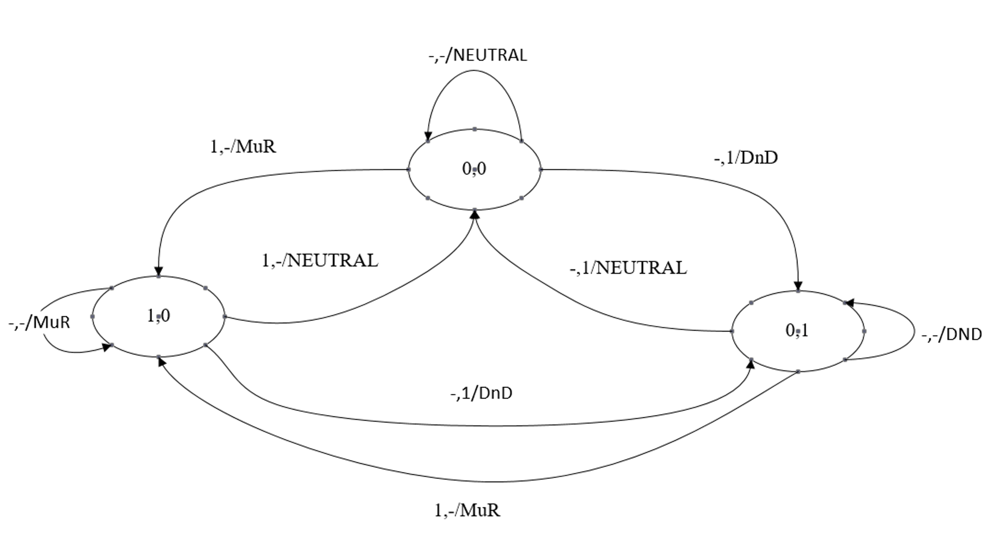

## Question 5 Finite State Machine(cscms problem 48)

Mr. Ukrit is a new manager of Continental Hotel, Bangkok. He has to be prepared to welcome the most famous assassin of the continental ground, Mr. John Wick. He develops IoT light switches showing his customer need to inform butlers. These light switches are toggle switches. One of switches has a light signal of “Make Up Room” (MuR). Another one has a light signal of “Do not Disturb” (DnD). These two switches can be both “off”, but either one of them can be “on” at a time. There are two states of signal which are 0 and 1 representing "on" and "off" respectively.

The input consists of two lines. The first line is a pair of current state representing the on/off status of each switch. The second line is the switch input clicking of MuR switch and DnD switch, each represented by “1” or “-” where "1" represents clicking and "-" represents not clicking. The output is the status of the next state which are either "NEUTRAL" if both switch off, "MuR" if the MuR switch is on, or "DnD" if the DnD switch is on. Examples are provided in the table below.

|Current State (first line of input)|Clicking (second line of input)|Next State (output)|
|:-------------:|:-----------:|:-----------:|
| 0 0 | - 1 | DnD |
| 0 1 | 1 - | MuR |

With these conditions, it can be depicted by using the Finite State Machine diagram shown below.

### For example:

| **Input**    | **Result** |
| :----------- | :--------- |
| 0 0   - - | NEUTRAL    |
| 0 0   - 1 | DnD        |
| 0 0   1 - | MuR        |
| 1 0   - 1 | DnD        |
| 0 1   - - | DnD        |
| 0 1   1 - | MuR        |